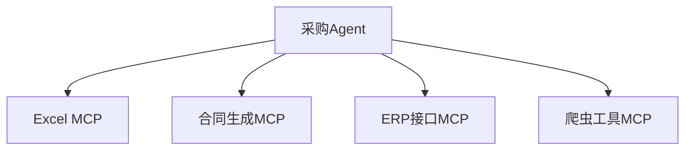
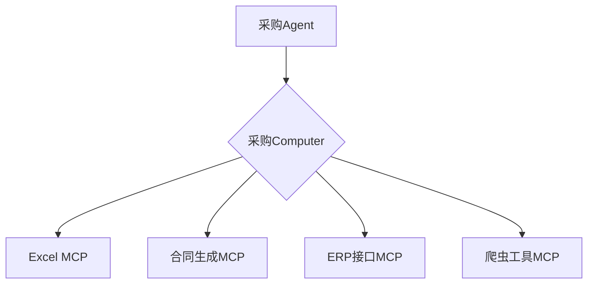

# A2C-SMCP远程调用协议 (Agent To Computer SMCP)

## 设计目标与背景

A2C-SMCP（旨在解决MCP协议在Agent系统中的核心痛点：

1. **多MCP服务管理问题**  
   引入`Computer`概念统一管理主机上的多个MCP服务，简化Agent与多工具服务交互

2. **工具权限与安全挑战**  
   - 工具鉴权（如Token过期/权限过高问题）
   - 证书管理（如Office版权归属问题）
   - 网络依赖（跨域请求、内网穿透、代理管理）

A2C-SMCP 通过在 Agent 与工具之间引入“Computer”概念，有效简化了 Agent 对多工具的统一管理，以及在安全性和版权方面所面临的挑战。`Computer` 
的具体实现基于 MCP 协议，因此理论上，工具开发者只需实现 MCP 协议即可，无需额外适配(原MCP Server开发者不需要做任何改动)。

A2C-SMCP 协议主要由 Agent 开发者进行集成和定制，工具开发者无需关注协议的具体实现细节。同时，Agent 开发者也无需担心与框架的深度耦合问题。协议
经过精心设计，仅需在 Agent 框架中实现协议规定的部分接口即可完成对接，A2C-SMCP 不会对 Agent 框架的选型等做出强制要求。

A2C-SMCP 旨在解决传统MCP协议在复杂Agent系统中面临的关键挑战。我们通过两个核心场景说明设计动机：

### 场景1：工具服务海啸问题（多MCP管理困境）
**背景示例**  
某企业AI团队开发的采购Agent需要协调：
- 本地Excel工具（处理采购清单）
- 云端合同生成服务
- 内部ERP系统接口
- 供应商比价爬虫工具

**MCP痛点**  

- 🤯 **管理黑洞**：Agent需单独维护每个MCP的生命周期
- 💔 **断连风险**：任一MCP崩溃导致整个采购流程失败
- 🚫 **资源浪费**：空闲MCP持续占用系统资源

**SMCP解决方案**  

- 🛡️ **故障隔离**：单个MCP崩溃不影响Computer整体
- 📡 **热插拔支持**：动态增删工具无需重启Agent
- ⚙️ **统一监护**：Computer内部实施服务健康监测

---

现在我们需要再添加针对 MCP 协议的 Resources适配与管理能力。

目前MCP Resources有以下能力：

1. Servers that support resources MUST declare the resources capability:

Copy
{
  "capabilities": {
    "resources": {
      "subscribe": true,
      "listChanged": true
    }
  }
}
The capability supports two optional features:
subscribe: whether the client can subscribe to be notified of changes to individual resources.
listChanged: whether the server will emit notifications when the list of available resources changes.
Both subscribe and listChanged are optional—servers can support neither, either, or both:

Copy
{
  "capabilities": {
    "resources": {} // Neither feature supported
  }
}

Copy
{
  "capabilities": {
    "resources": {
      "subscribe": true // Only subscriptions supported
    }
  }
}

Copy
{
  "capabilities": {
    "resources": {
      "listChanged": true // Only list change notifications supported
    }
  }
}
​

2. Listing Resources
To discover available resources, clients send a resources/list request. This operation supports pagination.
Request:

{
  "jsonrpc": "2.0",
  "id": 1,
  "method": "resources/list",
  "params": {
    "cursor": "optional-cursor-value"
  }
}
Response:

{
  "jsonrpc": "2.0",
  "id": 1,
  "result": {
    "resources": [
      {
        "uri": "file:///project/src/main.rs",
        "name": "main.rs",
        "title": "Rust Software Application Main File",
        "description": "Primary application entry point",
        "mimeType": "text/x-rust"
      }
    ],
    "nextCursor": "next-page-cursor"
  }
}
​
3. Reading Resources
To retrieve resource contents, clients send a resources/read request:
Request:

{
  "jsonrpc": "2.0",
  "id": 2,
  "method": "resources/read",
  "params": {
    "uri": "file:///project/src/main.rs"
  }
}
Response:

{
  "jsonrpc": "2.0",
  "id": 2,
  "result": {
    "contents": [
      {
        "uri": "file:///project/src/main.rs",
        "name": "main.rs",
        "title": "Rust Software Application Main File",
        "mimeType": "text/x-rust",
        "text": "fn main() {\n    println!(\"Hello world!\");\n}"
      }
    ]
  }
}
​
4. Resource Templates
Resource templates allow servers to expose parameterized resources using URI templates. Arguments may be auto-completed through the completion API.
Request:
{
  "jsonrpc": "2.0",
  "id": 3,
  "method": "resources/templates/list"
}
Response:

{
  "jsonrpc": "2.0",
  "id": 3,
  "result": {
    "resourceTemplates": [
      {
        "uriTemplate": "file:///{path}",
        "name": "Project Files",
        "title": "📁 Project Files",
        "description": "Access files in the project directory",
        "mimeType": "application/octet-stream"
      }
    ]
  }
}
​
5. List Changed Notification
When the list of available resources changes, servers that declared the listChanged capability SHOULD send a notification:

{
  "jsonrpc": "2.0",
  "method": "notifications/resources/list_changed"
}
​
6. Subscriptions
The protocol supports optional subscriptions to resource changes. Clients can subscribe to specific resources and receive notifications when they change:
Subscribe Request:

{
  "jsonrpc": "2.0",
  "id": 4,
  "method": "resources/subscribe",
  "params": {
    "uri": "file:///project/src/main.rs"
  }
}
Update Notification:

{
  "jsonrpc": "2.0",
  "method": "notifications/resources/updated",
  "params": {
    "uri": "file:///project/src/main.rs",
    "title": "Rust Software Application Main File"
  }
}
​
基于以上能力，现在我需要扩展SMCP的定义，使SMCP也具有以上能力相关实现。现在我们开始第一步，扩展SMCP的定义文件。
