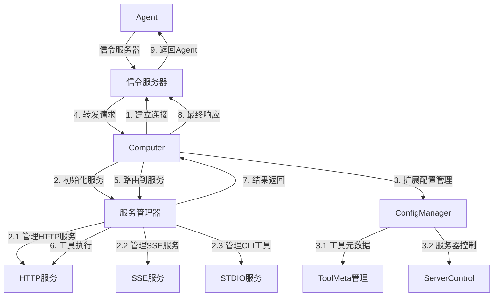
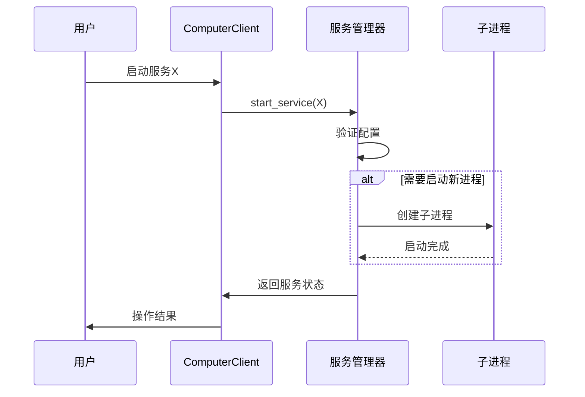
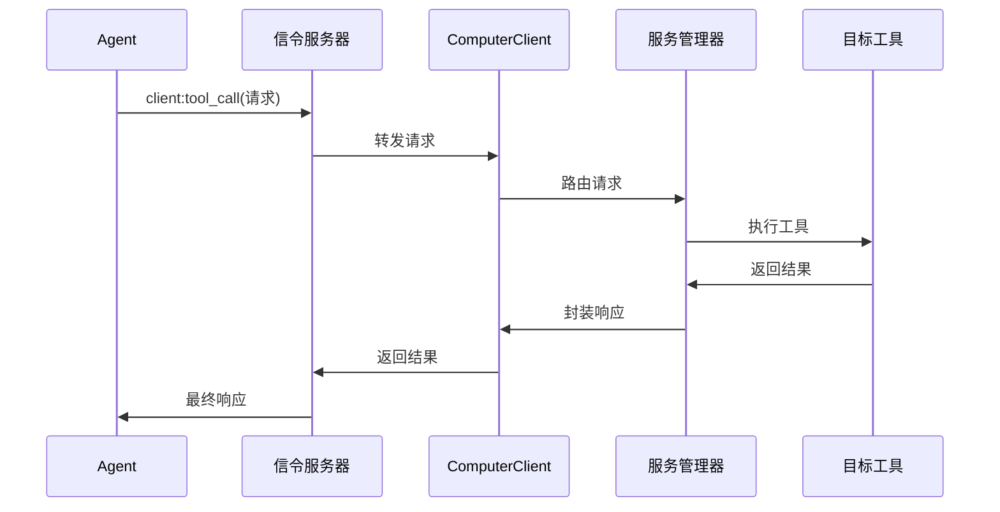

# A2C-SMCP Computer客户端实现文档

## 设计目标与背景

### 核心挑战
- **多协议服务管理**：管理PC上运行的不同类型服务（HTTP/SSE/stdio）
- **强类型配置支持**：基于Pydantic模型实现严格的服务器参数定义
- **工具级别控制**：支持工具级别的`auto_apply`、`ret_object_mapper`等元数据
- **动态配置热更新**：实现配置变更的实时生效
- **企业级安全控制**：增强工具限制和进程隔离能力

### 协议核心架构



## 核心模块设计

### 1. 服务管理器

```python
class MCPServiceManager:
    """多协议服务管理器"""
    
    def __init__(self):
        self.servers: Dict[str, ServerInstance] = {}
        self.config_manager = ConfigManager()
        
    async def initialize_servers(self, config_path: str):
        """初始化所有服务"""
        self.config_manager.load_config(config_path)
        
        for server_id, config in self.config_manager.servers.items():
            if config.disabled:
                continue
                
            if isinstance(config.params, StdioServerParameters):
                self.servers[server_id] = StdioServer(config.params)
            elif isinstance(config.params, SseServerParameters):
                self.servers[server_id] = SseServer(config.params)
            elif isinstance(config.params, StreamableHttpParameters):
                self.servers[server_id] = HttpServer(config.params)
    
    async def handle_tool_request(self, request: ToolCallReq) -> ToolCallResult:
        """处理工具调用请求"""
        server_id = self._determine_server(request.tool_name)
        
        # 检查工具是否被禁用
        if not self.config_manager.is_tool_allowed(server_id, request.tool_name):
            return ToolCallResult(error="Tool is forbidden")
        
        # 获取工具元数据
        tool_meta = self.config_manager.get_tool_meta(server_id, request.tool_name)
        
        # 调用服务执行工具
        server = self.servers[server_id]
        result = await server.call_tool(request.tool_name, request.arguments)
        
        # 应用返回值映射
        if tool_meta and "ret_object_mapper" in tool_meta:
            result = self._apply_object_mapper(result, tool_meta["ret_object_mapper"])
            
        return result
```

### 2. 配置管理器

```python
class ConfigManager:
    """配置管理器，支持强类型服务器参数"""
    
    def __init__(self):
        self.servers: Dict[str, ServerConfig] = {}
    
    def load_config(self, config_path: str):
        """加载配置文件"""
        with open(config_path) as f:
            raw_config = json.load(f)
        
        for server_id, config_data in raw_config.items():
            self.servers[server_id] = self._parse_config(config_data)
    
    def _parse_config(self, config_data: Dict) -> ServerConfig:
        """解析服务器配置"""
        server_type = config_data["type"]
        params = None
        
        if server_type == "stdio":
            params = StdioServerParameters(**config_data["params"])
        elif server_type == "sse":
            params = SseServerParameters(**config_data["params"])
        elif server_type == "http":
            params = StreamableHttpParameters(**config_data["params"])
        
        return ServerConfig(
            type=server_type,
            params=params,
            tool_meta=config_data.get("tool_meta", {}),
            forbidden_tools=config_data.get("forbidden_tools", []),
            disabled=config_data.get("disabled", False)
        )
    
    def is_tool_allowed(self, server_id: str, tool_name: str) -> bool:
        """检查工具是否允许使用"""
        return tool_name not in self.servers[server_id].forbidden_tools
    
    def get_tool_meta(self, server_id: str, tool_name: str) -> Optional[Dict]:
        """获取工具元数据"""
        return self.servers[server_id].tool_meta.get(tool_name)
```

### 3. 服务实例实现

```python
class StdioServer:
    """STDIO服务实现"""
    
    def __init__(self, params: StdioServerParameters):
        self.params = params
        self.process: Optional[Process] = None
    
    async def start(self):
        """启动服务进程"""
        env = self.params.env or get_default_environment()
        self.process = await asyncio.create_subprocess_exec(
            self.params.command,
            *self.params.args,
            env=env,
            cwd=self.params.cwd,
            stdin=asyncio.subprocess.PIPE,
            stdout=asyncio.subprocess.PIPE,
            stderr=asyncio.subprocess.PIPE
        )
    
    async def call_tool(self, tool_name: str, args: Dict) -> Dict:
        """调用工具"""
        if not self.process:
            raise RuntimeError("Server not started")
        
        request = json.dumps({"tool": tool_name, "args": args})
        self.process.stdin.write(request.encode(self.params.encoding))
        await self.process.stdin.drain()
        
        output = await self.process.stdout.read()
        return json.loads(output.decode(self.params.encoding))
```

## 服务器参数定义

### 1. STDIO服务参数

```python
class StdioServerParameters(BaseModel):
    command: str
    """The executable to run to start the server."""

    args: list[str] = Field(default_factory=list)
    """Command line arguments to pass to the executable."""

    env: dict[str, str] | None = None
    """
    The environment to use when spawning the process.

    If not specified, the result of get_default_environment() will be used.
    """

    cwd: str | Path | None = None
    """The working directory to use when spawning the process."""

    encoding: str = "utf-8"
    """
    The text encoding used when sending/receiving messages to the server

    defaults to utf-8
    """

    encoding_error_handler: Literal["strict", "ignore", "replace"] = "strict"
    """
    The text encoding error handler.

    See https://docs.python.org/3/library/codecs.html#codec-base-classes for
    explanations of possible values
    """
```

### 2. SSE服务参数

```python
class SseServerParameters(BaseModel):
    """Parameters for intializing a sse_client."""

    # The endpoint URL.
    url: str

    # Optional headers to include in requests.
    headers: dict[str, Any] | None = None

    # HTTP timeout for regular operations.
    timeout: float = 5

    # Timeout for SSE read operations.
    sse_read_timeout: float = 60 * 5
```

### 3. HTTP流式服务参数

```python
class StreamableHttpParameters(BaseModel):
    """Parameters for intializing a streamablehttp_client."""

    # The endpoint URL.
    url: str

    # Optional headers to include in requests.
    headers: dict[str, Any] | None = None

    # HTTP timeout for regular operations.
    timeout: timedelta = timedelta(seconds=30)

    # Timeout for SSE read operations.
    sse_read_timeout: timedelta = timedelta(seconds=60 * 5)

    # Close the client session when the transport closes.
    terminate_on_close: bool = True
```

## 配置热更新实现

### 支持配置变更检测

```python
class ConfigHotReloader:
    """配置热更新管理器"""
    
    def __init__(self, service_manager: MCPServiceManager):
        self.service_manager = service_manager
        self.file_watcher = None
    
    async def start_watching(self, config_path: str):
        """开始监控配置文件变更"""
        self.file_watcher = asyncio.create_task(
            self._watch_config_file(config_path)
        )
    
    async def _watch_config_file(self, config_path: str):
        """监控配置文件变更"""
        last_modified = os.path.getmtime(config_path)
        
        while True:
            await asyncio.sleep(1)
            current_modified = os.path.getmtime(config_path)
            
            if current_modified > last_modified:
                await self._reload_configuration(config_path)
                last_modified = current_modified
    
    async def _reload_configuration(self, config_path: str):
        """重新加载配置"""
        try:
            # 停止所有服务
            for server in self.service_manager.servers.values():
                await server.stop()
            
            # 重新加载配置
            self.service_manager.config_manager.load_config(config_path)
            
            # 重新启动服务
            await self.service_manager.initialize_servers(config_path)
            
            logger.info("Configuration reloaded successfully")
        except Exception as e:
            logger.error(f"Failed to reload configuration: {e}")
```

## 部署和运行

### 安装依赖

```bash
pip install pydantic python-socketio[asyncio] aiohttp
```

### 主程序实现

```python
async def main():
    """主程序入口"""
    # 初始化服务管理器
    service_manager = MCPServiceManager()
    await service_manager.initialize_servers("config.json")
    
    # 初始化SocketIO客户端
    client = SMCPComputerClient(service_manager)
    
    # 启动配置热更新
    hot_reloader = ConfigHotReloader(service_manager)
    await hot_reloader.start_watching("config.json")
    
    # 连接到信令服务器
    await client.connect(config.server_url)
    
    try:
        await client.wait()
    except KeyboardInterrupt:
        logger.info("Shutting down...")
    finally:
        # 清理资源
        for server in service_manager.servers.values():
            await server.stop()

if __name__ == "__main__":
    asyncio.run(main())
```

## 关键工作流程

### 1. 服务启动流程



### 2. 工具调用流程



## 进程管理实现

### 进程生命周期管理

```python
class ProcessManager:
    """进程生命周期管理器"""
    
    def __init__(self):
        self.processes: Dict[str, Process] = {}
    
    async def start_process(self, server_id: str, params: StdioServerParameters):
        """启动新进程"""
        if server_id in self.processes:
            await self.stop_process(server_id)
        
        env = params.env or get_default_environment()
        process = await asyncio.create_subprocess_exec(
            params.command,
            *params.args,
            env=env,
            cwd=params.cwd,
            stdin=asyncio.subprocess.PIPE,
            stdout=asyncio.subprocess.PIPE,
            stderr=asyncio.subprocess.PIPE
        )
        
        self.processes[server_id] = process
    
    async def stop_process(self, server_id: str):
        """停止进程"""
        process = self.processes.pop(server_id, None)
        if process:
            process.terminate()
            await process.wait()
    
    async def restart_process(self, server_id: str, params: StdioServerParameters):
        """重启进程"""
        await self.stop_process(server_id)
        await self.start_process(server_id, params)
```

## 配置结构定义

### 完整服务器配置

```python
class ServerConfig(BaseModel):
    """服务器完整配置"""
    type: Literal["stdio", "sse", "http"]
    params: Union[StdioServerParameters, SseServerParameters, StreamableHttpParameters]
    tool_meta: Dict[str, Dict] = Field(default_factory=dict)
    forbidden_tools: List[str] = Field(default_factory=list)
    disabled: bool = False
```

## 安全与可靠性保障

### 1. 进程安全策略

| **风险** | **应对方案** | 
|---------|-------------|
| **僵尸进程** | 进程生命周期管理器确保终止 | 
| **资源泄漏** | 资源使用限制和监控 | 
| **异常崩溃** | 子进程心跳检测+自动重启 | 

### 2. 连接可靠性方案

```python
class ReconnectStrategy:
    def __init__(self, client: SMCPComputerClient):
        self.client = client
        self.retry_count = 0
        self.max_retries = float('inf')
    
    async def run(self):
        while self.retry_count < self.max_retries:
            try:
                await self.client.connect()
                break
            except ConnectionError:
                delay = min(2 ** self.retry_count, 60)  # 指数退避
                await asyncio.sleep(delay)
                self.retry_count += 1
```

## 部署方案

### 系统服务配置（systemd）

```ini
# /etc/systemd/system/smcp-computer.service
[Unit]
Description=SMCP Computer Client

[Service]
ExecStart=/usr/bin/python3 /opt/smcp/computer.py
Restart=always
RestartSec=30
User=smcp
Group=smcp

[Install]
WantedBy=multi-user.target
```

## 核心优势总结

1. **强类型配置**  
   - 基于Pydantic的严格参数验证
   - 支持三种协议的标准参数定义

2. **多协议支持**  
   - 完整支持HTTP/SSE/stdio类型服务
   - 统一的服务管理接口

3. **配置热更新**  
   - 配置变动实时生效
   - 服务热重载无需重启

4. **企业级安全**  
   - 本地配置加密存储
   - 子进程权限隔离
   - 连接自动恢复机制

5. **灵活扩展**  
   - 易于添加新协议支持
   - 工具元数据灵活配置
   - 模块化设计