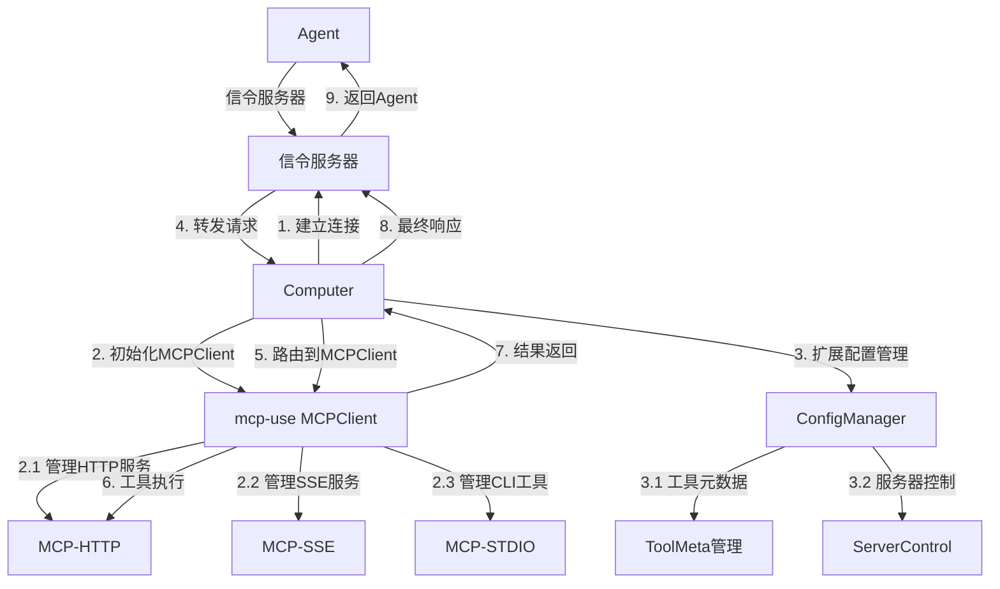
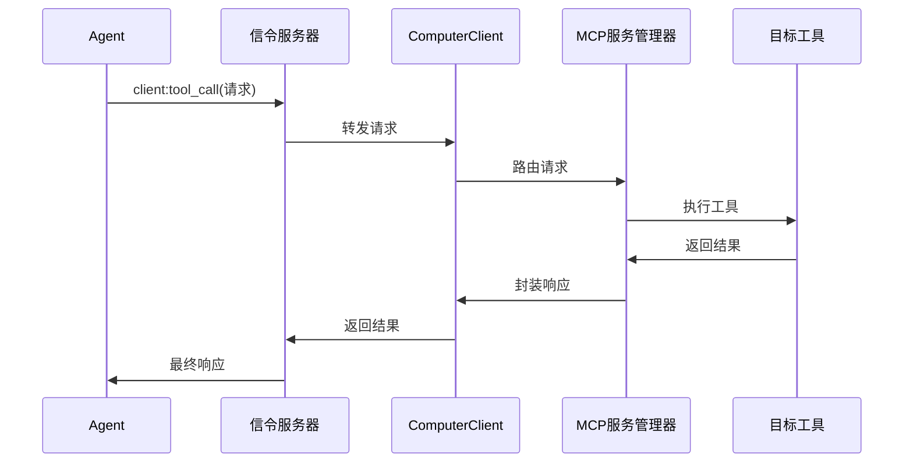
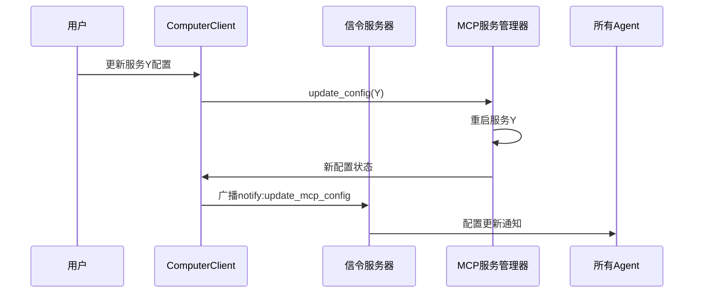

# A2C-SMCP Computer客户端实现文档（基于mcp-use）

## 设计目标与背景

### 核心挑战
- **多MCP服务管理**：基于 `mcp-use` 库管理PC上运行的不同类型MCP服务（HTTP/SSE/stdio）
- **配置扩展支持**：在 `mcp-use` 基础配置上扩展自定义元数据管理
- **工具级别控制**：支持工具级别的 `auto_apply`、`ret_object_mapper` 等元数据
- **动态配置热更新**：扩展 `mcp-use` 的配置管理能力
- **企业级安全控制**：基于 `mcp-use` 的工具限制功能增强安全性

### 协议核心架构



## 核心模块设计

### 1. 基于mcp-use的扩展服务管理器

```python
class ExtendedMCPServiceManager:
    """基于 mcp-use 的扩展 MCP 服务管理器"""
    
    def __init__(self):
        self.mcp_client: MCPClient = None
        self.extended_config: Dict[str, MCPServerConfig] = {}
        self.config_manager = ExtendedConfigManager()
        
    def create_mcp_client_config(self) -> Dict[str, Any]:
        """将扩展配置转换为 mcp-use 兼容的配置"""
        mcp_config = {"mcpServers": {}}
        
        for server_id, config in self.extended_config.items():
            if config.get("disabled", False):
                continue
                
            if config["type"] == "stdio":
                mcp_config["mcpServers"][server_id] = {
                    "command": config["command"],
                    "args": config.get("args", []),
                    "env": config.get("env", {})
                }
            elif config["type"] in ["http", "sse"]:
                mcp_config["mcpServers"][server_id] = {
                    "url": config["url"],
                    "headers": config.get("headers", {})
                }
                
        return mcp_config
    
    async def initialize_client(self):
        """初始化 mcp-use 客户端"""
        mcp_config = self.create_mcp_client_config()
        self.mcp_client = MCPClient.from_dict(mcp_config)
        await self.mcp_client.create_all_sessions()
    
    async def handle_tool_request(self, request: ToolCallReq) -> ToolCallResult:
        """处理工具调用请求，支持扩展元数据"""
        server_id = self._determine_server(request.tool_name)
        
        # 检查工具是否被禁用
        server_config = self.extended_config.get(server_id, {})
        if request.tool_name in server_config.get("forbidden_tools", []):
            return ToolCallResult(error="Tool is forbidden")
        
        # 获取工具元数据
        tool_meta = server_config.get("tool_meta", {}).get(request.tool_name, {})
        
        # 调用 mcp-use 客户端执行工具
        session = self.mcp_client.get_session(server_id)
        result = await session.call_tool(request.tool_name, request.arguments)
        
        # 应用返回值映射
        if "ret_object_mapper" in tool_meta:
            result = self._apply_object_mapper(result, tool_meta["ret_object_mapper"])
            
        return result
```

### 2. 扩展配置管理器

```python
class ExtendedConfigManager:
    """扩展的配置管理器，支持自定义元数据"""
    
    def __init__(self, config_path: str):
        self.config_path = config_path
        self.base_config: Dict[str, MCPServerConfig] = {}
        self.input_processors: Dict[str, MCPServerInput] = {}
    
    def load_extended_config(self) -> Dict[str, MCPServerConfig]:
        """加载扩展配置，包含所有自定义字段"""
        with open(self.config_path) as f:
            raw_config = json.load(f)
        
        # 解析包含自定义字段的配置
        for server_id, config_data in raw_config.items():
            self.base_config[server_id] = self._parse_server_config(config_data)
            
        return self.base_config
    
    def _parse_server_config(self, config_data: Dict) -> MCPServerConfig:
        """解析服务器配置，支持所有自定义字段"""
        # 保留所有原有字段，包括 tool_meta, forbidden_tools 等
        return MCPServerConfig(**config_data)
    
    def get_mcp_use_compatible_config(self) -> Dict[str, Any]:
        """生成 mcp-use 兼容的配置"""
        compatible_config = {"mcpServers": {}}
        
        for server_id, config in self.base_config.items():
            if config.get("disabled", False):
                continue
                
            # 只提取 mcp-use 需要的字段
            server_config = self._extract_mcp_use_fields(config)
            compatible_config["mcpServers"][server_id] = server_config
            
        return compatible_config
```

### 3. 集成SocketIO客户端 [2](#0-1) 

```python
class SMCPComputerClient(socketio.AsyncClient):
    def __init__(self):
        super().__init__(reconnection_attempts=float('inf'))
        self.service_manager = ExtendedMCPServiceManager()
        self.mcp_agent: MCPAgent = None
        
        # 事件处理注册
        self.on("connect", self.on_connect)
        self.on("client:tool_call", self.handle_tool_call)
        self.on("client:get_tools", self.handle_get_tools)
        
    async def initialize_mcp_agent(self, llm):
        """初始化基于 mcp-use 的 Agent"""
        await self.service_manager.initialize_client()
        
        # 创建 mcp-use Agent，支持工具限制
        self.mcp_agent = MCPAgent(
            llm=llm,
            client=self.service_manager.mcp_client,
            disallowed_tools=self._get_all_forbidden_tools(),
            use_server_manager=True  # 启用服务器管理器
        )
    
    def _get_all_forbidden_tools(self) -> List[str]:
        """获取所有被禁用的工具列表"""
        forbidden = []
        for config in self.service_manager.extended_config.values():
            forbidden.extend(config.get("forbidden_tools", []))
        return forbidden
    
    async def handle_tool_call(self, data):
        """处理工具调用，支持自定义元数据"""
        return await self.service_manager.handle_tool_request(data)
```

## 配置扩展方案

### 1. 配置兼容性处理 [3](#0-2) 

由于 `mcp-use` 的配置结构相对简单，我们需要创建适配层来支持你的扩展配置：

```python
class ConfigAdapter:
    """配置适配器，在mcp-use配置和扩展配置之间转换"""
    
    @staticmethod
    def to_mcp_use_format(extended_config: MCPServerConfig) -> Dict[str, Any]:
        """将扩展配置转换为 mcp-use 格式"""
        base_config = {}
        
        if extended_config["type"] == "stdio":
            base_config.update({
                "command": extended_config["command"],
                "args": extended_config.get("args", []),
                "env": extended_config.get("env", {})
            })
        elif extended_config["type"] in ["http", "sse"]:
            base_config.update({
                "url": extended_config["url"],
                "headers": extended_config.get("headers", {})
            })
            
        return base_config
    
    @staticmethod
    def preserve_metadata(extended_config: MCPServerConfig) -> Dict[str, Any]:
        """保存 mcp-use 不支持的元数据"""
        metadata = {
            "tool_meta": extended_config.get("tool_meta", {}),
            "forbidden_tools": extended_config.get("forbidden_tools", []),
            "disabled": extended_config.get("disabled", False)
        }
        return metadata
```

### 2. 工具级别控制增强 [4](#0-3) 

基于 `mcp-use` 的工具限制功能，扩展工具级别的控制：

```python
class EnhancedToolController:
    """增强的工具控制器"""
    
    def __init__(self, service_manager: ExtendedMCPServiceManager):
        self.service_manager = service_manager
    
    def is_tool_allowed(self, server_id: str, tool_name: str) -> bool:
        """检查工具是否被允许使用"""
        config = self.service_manager.extended_config.get(server_id, {})
        return tool_name not in config.get("forbidden_tools", [])
    
    def should_auto_apply(self, server_id: str, tool_name: str) -> bool:
        """检查工具是否应该自动应用"""
        config = self.service_manager.extended_config.get(server_id, {})
        tool_meta = config.get("tool_meta", {}).get(tool_name, {})
        return tool_meta.get("auto_apply", False)
    
    def get_object_mapper(self, server_id: str, tool_name: str) -> Dict:
        """获取工具的对象映射配置"""
        config = self.service_manager.extended_config.get(server_id, {})
        tool_meta = config.get("tool_meta", {}).get(tool_name, {})
        return tool_meta.get("ret_object_mapper", {})
```

## 进程管理实现

### 基于mcp-use的进程管理 [5](#0-4) 

`mcp-use` 已经提供了基本的会话管理和进程管理能力，我们在此基础上增强：

```python
class EnhancedProcessManager:
    """增强的进程管理器，基于mcp-use的会话管理"""
    
    def __init__(self, mcp_client: MCPClient):
        self.mcp_client = mcp_client
        self.process_health_checker = ProcessHealthChecker()
    
    async def start_all_services(self):
        """启动所有服务，利用mcp-use的会话管理"""
        await self.mcp_client.create_all_sessions(auto_initialize=True)
        
        # 启动健康检查
        asyncio.create_task(self.process_health_checker.start_monitoring(
            self.mcp_client.sessions
        ))
    
    async def restart_service(self, server_name: str):
        """重启指定服务"""
        # 关闭现有会话
        await self.mcp_client.close_session(server_name)
        
        # 重新创建会话
        await self.mcp_client.create_session(server_name)
    
    async def stop_all_services(self):
        """安全停止所有服务"""
        await self.mcp_client.close_all_sessions()
```

## 配置热更新实现

### 支持配置变更检测

```python
class ConfigHotReloader:
    """配置热更新管理器"""
    
    def __init__(self, service_manager: ExtendedMCPServiceManager):
        self.service_manager = service_manager
        self.file_watcher = None
    
    async def start_watching(self, config_path: str):
        """开始监控配置文件变更"""
        self.file_watcher = asyncio.create_task(
            self._watch_config_file(config_path)
        )
    
    async def _watch_config_file(self, config_path: str):
        """监控配置文件变更"""
        last_modified = os.path.getmtime(config_path)
        
        while True:
            await asyncio.sleep(1)
            current_modified = os.path.getmtime(config_path)
            
            if current_modified > last_modified:
                await self._reload_configuration(config_path)
                last_modified = current_modified
    
    async def _reload_configuration(self, config_path: str):
        """重新加载配置"""
        try:
            # 加载新配置
            new_config = self.service_manager.config_manager.load_extended_config()
            
            # 比较变更并更新 mcp-use 客户端
            await self._update_mcp_client(new_config)
            
            logger.info("Configuration reloaded successfully")
        except Exception as e:
            logger.error(f"Failed to reload configuration: {e}")
```

## 部署和运行

### 安装依赖

```bash
# 安装 mcp-use 和相关依赖
pip install mcp-use
pip install langchain-openai  # 或其他LLM提供商
pip install python-socketio[asyncio]

# 安装项目特定依赖
pip install -r requirements.txt
```

### 主程序实现

```python
async def main():
    """主程序入口"""
    # 初始化服务管理器
    service_manager = ExtendedMCPServiceManager()
    
    # 加载扩展配置
    service_manager.config_manager.load_extended_config()
    
    # 初始化 mcp-use 客户端
    await service_manager.initialize_client()
    
    # 创建LLM（可根据需要选择）
    llm = ChatOpenAI(model="gpt-4o")
    
    # 初始化SocketIO客户端
    client = SMCPComputerClient()
    await client.initialize_mcp_agent(llm)
    
    # 启动配置热更新
    hot_reloader = ConfigHotReloader(service_manager)
    await hot_reloader.start_watching("config.json")
    
    # 连接到信令服务器
    await client.connect(config.server_url)
    
    try:
        await client.wait()
    except KeyboardInterrupt:
        logger.info("Shutting down...")
    finally:
        # 清理资源
        await service_manager.mcp_client.close_all_sessions()

if __name__ == "__main__":
    asyncio.run(main())
```

## mcp-use扩展能力总结

### 1. 现有支持的功能 [6](#0-5) 

- **工具限制**：通过 `disallowed_tools` 参数支持工具级别的访问控制
- **多服务器管理**：原生支持多个 MCP 服务器的并发管理
- **动态服务器选择**：支持智能路由到合适的服务器

### 2. 需要扩展的部分

- **工具元数据**：需要自行实现 `tool_meta` 的管理和应用
- **服务器级别控制**：需要在 `mcp-use` 基础上添加 `disabled` 状态管理
- **返回值映射**：需要实现 `ret_object_mapper` 功能
- **配置输入处理**：需要实现复杂的输入类型系统

### 3. 扩展策略

通过**适配器模式**和**配置分层**的方式，在 `mcp-use` 的基础上构建扩展功能，既利用了其强大的 MCP 协议支持和进程管理能力，又保持了你的个性化配置需求。

## Notes

`mcp-use` 库提供了强大的 MCP 服务器管理基础，但其配置结构相对简化。通过创建适配层和扩展管理器，可以在不修改 `mcp-use` 源码的情况下支持你的复杂配置需求。这种方案的优势是：

1. **保持兼容性**：完全兼容 `mcp-use` 的更新
2. **功能扩展**：支持所有自定义配置需求  
3. **进程稳定性**：利用 `mcp-use` 成熟的会话管理机制
4. **社区支持**：可以获得 `mcp-use` 社区的支持和更新

### 3. SocketIO客户端

```python
class SMCPComputerClient(socketio.AsyncClient):
    def __init__(self, manager: MCPServiceManager):
        self.manager = manager
        super().__init__(reconnection_attempts=float('inf'))
        
        # 事件处理注册
        self.on("connect", self.on_connect)
        self.on("disconnect", self.on_disconnect)
        self.on("client:tool_call", self.handle_tool_call)
        self.on("client:get_tools", self.handle_get_tools)
        self.on("client:get_mcp_config", self.handle_get_config)
        self.on("server:update_mcp_config", self.handle_config_update)
    
    async def on_connect(self):
        """连接成功后加入房间"""
        await self.emit("server:join_office", {
            "office_id": config.robot_id,
            "role": "computer"
        })
    
    async def handle_tool_call(self, data):
        """处理工具调用请求"""
        return await self.manager.handle_request(data)
    
    async def start(self):
        """连接到信令服务器"""
        await self.connect(
            config.server_url,
            auth={"token": f"Bearer {config.jwt_token}"},
            transports=['websocket']
        )
```

## 关键工作流程

### 1. 服务启动流程


### 2. 工具调用流程



### 3. 配置热更新流程



## 进程管理实现

### 进程生命周期同步方案

```python
# 计算机主入口
def main():
    service_manager = MCPServiceManager()
    
    # 加载初始配置
    with open("config.json") as f:
        configs = json.load(f)
    
    # 启动时创建所有服务
    for config in configs:
        service_manager.add_service(config)
    
    # 创建并管理子进程
    processes = []
    for service in service_manager.services.values():
        if service.requires_process:
            with ProcessGuard(target=service.run) as guard:
                service_manager.register_process(guard.process.pid)
                processes.append(guard)
    
    # 启动SocketIO客户端
    client = SMCPComputerClient(service_manager)
    asyncio.run(client.start())
    
    # 主线程等待
    try:
        while True:
            time.sleep(1)
    except KeyboardInterrupt:
        # 安全终止所有进程
        for guard in processes:
            guard.stop()
```

## 配置管理设计

### 1. 配置结构

```python
class MCPConfig(BaseModel):
    id: str = Field(default_factory=lambda: str(uuid.uuid4()))
    type: Literal["http", "sse", "stdio"]
    name: str
    description: str = ""
    
    # 服务特定配置
    url: Optional[str] = None            # HTTP/SSE类型
    command: Optional[str] = None       # STDIO类型
    working_dir: Optional[str] = None   # 工作目录
    
    # 运行参数
    enabled: bool = True
    tool_meta: Dict[str, dict] = {}     # 工具元数据
```

### 2. 配置持久化

```python
class ConfigManager:
    def __init__(self, config_path: str):
        self.path = config_path
        self.configs: Dict[str, MCPConfig] = {}
    
    def load(self):
        """从文件加载配置"""
        if os.path.exists(self.path):
            with open(self.path) as f:
                data = json.load(f)
            self.configs = {cfg.id: cfg for cfg in map(MCPConfig.parse_obj, data)}
    
    def save(self):
        """保存配置到文件"""
        with open(self.path, "w") as f:
            json.dump([cfg.dict() for cfg in self.configs.values()], f, indent=2)
    
    def get_config(self, config_id: str) -> Optional[MCPConfig]:
        return self.configs.get(config_id)
    
    def update_config(self, config: MCPConfig):
        """更新配置"""
        self.configs[config.id] = config
        self.save()
```

## 用户接口设计

### 1. CLI控制界面

```python
def show_cli():
    while True:
        print(f"""
        A2C-SMCP Computer Control Panel
        --------------------------------
        1. 列出所有服务
        2. 启动/停止服务
        3. 添加新服务
        4. 修改服务配置
        5. 查看服务状态
        6. 重新加载所有服务
        7. 退出
        """)
        
        choice = input("请选择操作: ")
        
        if choice == "1":
            list_services()
        elif choice == "2":
            toggle_service()
        # ...其他操作
        elif choice == "7":
            break
```

### 2. REST管理接口（可选）

```python
from fastapi import FastAPI

app = FastAPI()

@app.get("/services")
async def list_services():
    return manager.list_services()

@app.post("/services")
async def create_service(config: MCPConfig):
    manager.add_service(config)

@app.put("/services/{service_id}")
async def update_service(service_id: str, config: MCPConfig):
    manager.update_config(service_id, config)
```

## 安全与可靠性保障

### 1. 进程安全策略

| **风险** | **应对方案** | 
|---------|-------------|
| **僵尸进程** | `ProcessGuard`上下文管理确保进程终止 | 
| **资源泄漏** | 资源使用限制和监控 | 
| **异常崩溃** | 子进程心跳检测+自动重启 | 

### 2. 连接可靠性方案

```python
class ReconnectStrategy:
    def __init__(self, client: SMCPComputerClient):
        self.client = client
        self.retry_count = 0
        self.max_retries = float('inf')
    
    async def run(self):
        while self.retry_count < self.max_retries:
            try:
                await self.client.connect()
                break
            except ConnectionError:
                delay = min(2 ** self.retry_count, 60)  # 指数退避
                await asyncio.sleep(delay)
                self.retry_count += 1
```

## 部署方案

### 安装与运行流程

```bash
# 1. 安装依赖
pip install -r requirements.txt

# 2. 准备配置文件
cp config.example.json config.json
vi config.json  # 编辑配置

# 3. 以守护进程运行
python computer.py --daemon

# 4. 使用控制面板
python computer.py --cli
```

### 系统服务配置（systemd）

```ini
# /etc/systemd/system/smcp-computer.service
[Unit]
Description=SMCP Computer Client

[Service]
ExecStart=/usr/bin/python3 /opt/smcp/computer.py
Restart=always
RestartSec=30
User=smcp
Group=smcp

[Install]
WantedBy=multi-user.target
```

## 核心优势总结

1. **统一生命周期管理**  
   - ProcessGuard确保父子进程同步生命周期
   - 自动清理僵尸进程

2. **多协议支持**  
   - 完整支持HTTP/SSE/stdio类型服务
   - 适配不同形态的工具服务

3. **配置热更新**  
   - 配置变动实时生效
   - 服务热重载无需重启

4. **企业级安全**  
   - 本地配置加密存储
   - 子进程权限隔离
   - 连接自动恢复机制

5. **灵活接口**  
   - CLI交互模式
   - 可选REST管理API
   - 后台守护进程模式