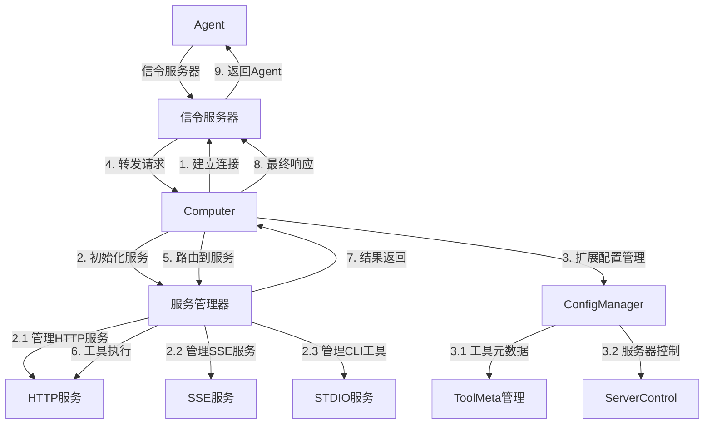
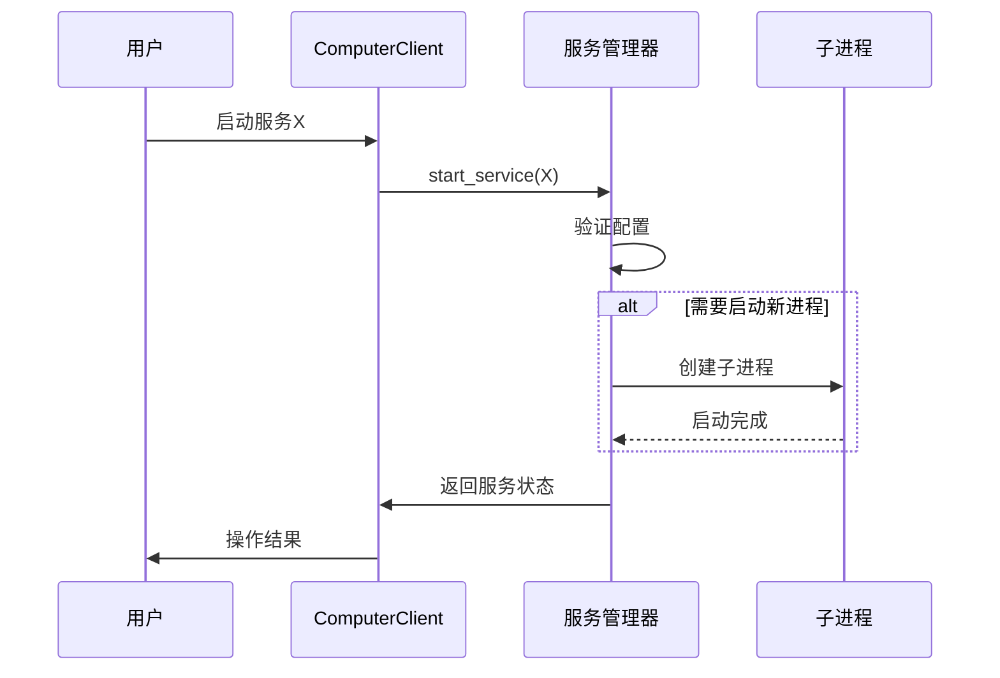
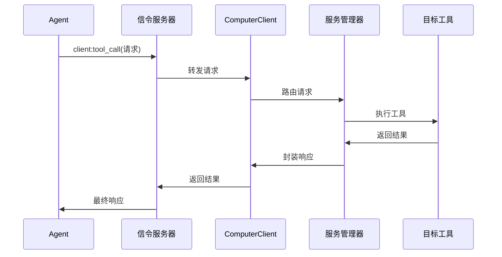
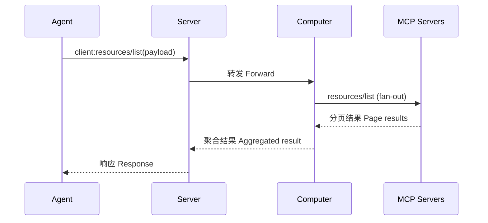
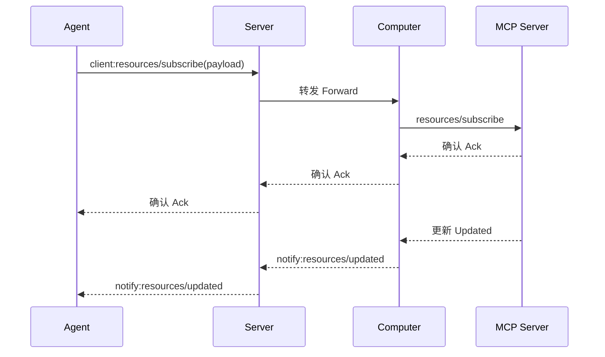

# A2C-SMCP Computer客户端实现文档

## 设计目标与背景

### 核心挑战
- **多协议服务管理**：管理PC上运行的不同类型服务（HTTP/SSE/stdio）
- **强类型配置支持**：基于Pydantic模型实现严格的服务器参数定义
- **工具级别控制**：支持工具级别的`auto_apply`、`ret_object_mapper`等元数据
- **动态配置热更新**：实现配置变更的实时生效
- **企业级安全控制**：增强工具限制和进程隔离能力

### 协议核心架构



## 核心模块设计

### 1. 服务管理器

```python
class MCPServiceManager:
    """多协议服务管理器"""
    
    def __init__(self):
        self.servers: Dict[str, ServerInstance] = {}
        self.config_manager = ConfigManager()
        
    async def initialize_servers(self, config_path: str):
        """初始化所有服务"""
        self.config_manager.load_config(config_path)
        
        for server_id, config in self.config_manager.servers.items():
            if config.disabled:
                continue
                
            if isinstance(config.params, StdioServerParameters):
                self.servers[server_id] = StdioServer(config.params)
            elif isinstance(config.params, SseServerParameters):
                self.servers[server_id] = SseServer(config.params)
            elif isinstance(config.params, StreamableHttpParameters):
                self.servers[server_id] = HttpServer(config.params)
    
    async def handle_tool_request(self, request: ToolCallReq) -> ToolCallResult:
        """处理工具调用请求"""
        server_id = self._determine_server(request.tool_name)
        
        # 检查工具是否被禁用
        if not self.config_manager.is_tool_allowed(server_id, request.tool_name):
            return ToolCallResult(error="Tool is forbidden")
        
        # 获取工具元数据
        tool_meta = self.config_manager.get_tool_meta(server_id, request.tool_name)
        
        # 调用服务执行工具
        server = self.servers[server_id]
        result = await server.call_tool(request.tool_name, request.arguments)
        
        # 应用返回值映射
        if tool_meta and "ret_object_mapper" in tool_meta:
            result = self._apply_object_mapper(result, tool_meta["ret_object_mapper"])
            
        return result
```

### 2. 配置管理器

```python
class ConfigManager:
    """配置管理器，支持强类型服务器参数"""
    
    def __init__(self):
        self.servers: Dict[str, ServerConfig] = {}
    
    def load_config(self, config_path: str):
        """加载配置文件"""
        with open(config_path) as f:
            raw_config = json.load(f)
        
        for server_id, config_data in raw_config.items():
            self.servers[server_id] = self._parse_config(config_data)
    
    def _parse_config(self, config_data: Dict) -> ServerConfig:
        """解析服务器配置"""
        server_type = config_data["type"]
        params = None
        
        if server_type == "stdio":
            params = StdioServerParameters(**config_data["params"])
        elif server_type == "sse":
            params = SseServerParameters(**config_data["params"])
        elif server_type == "http":
            params = StreamableHttpParameters(**config_data["params"])
        
        return ServerConfig(
            type=server_type,
            params=params,
            tool_meta=config_data.get("tool_meta", {}),
            forbidden_tools=config_data.get("forbidden_tools", []),
            disabled=config_data.get("disabled", False)
        )
    
    def is_tool_allowed(self, server_id: str, tool_name: str) -> bool:
        """检查工具是否允许使用"""
        return tool_name not in self.servers[server_id].forbidden_tools
    
    def get_tool_meta(self, server_id: str, tool_name: str) -> Optional[Dict]:
        """获取工具元数据"""
        return self.servers[server_id].tool_meta.get(tool_name)
```

### 3. 服务实例实现

```python
class StdioServer:
    """STDIO服务实现"""
    
    def __init__(self, params: StdioServerParameters):
        self.params = params
        self.process: Optional[Process] = None
    
    async def start(self):
        """启动服务进程"""
        env = self.params.env or get_default_environment()
        self.process = await asyncio.create_subprocess_exec(
            self.params.command,
            *self.params.args,
            env=env,
            cwd=self.params.cwd,
            stdin=asyncio.subprocess.PIPE,
            stdout=asyncio.subprocess.PIPE,
            stderr=asyncio.subprocess.PIPE
        )
    
    async def call_tool(self, tool_name: str, args: Dict) -> Dict:
        """调用工具"""
        if not self.process:
            raise RuntimeError("Server not started")
        
        request = json.dumps({"tool": tool_name, "args": args})
        self.process.stdin.write(request.encode(self.params.encoding))
        await self.process.stdin.drain()
        
        output = await self.process.stdout.read()
        return json.loads(output.decode(self.params.encoding))
```

## 服务器参数定义

### 1. STDIO服务参数

```python
class StdioServerParameters(BaseModel):
    command: str
    """The executable to run to start the server."""

    args: list[str] = Field(default_factory=list)
    """Command line arguments to pass to the executable."""

    env: dict[str, str] | None = None
    """
    The environment to use when spawning the process.

    If not specified, the result of get_default_environment() will be used.
    """

    cwd: str | Path | None = None
    """The working directory to use when spawning the process."""

    encoding: str = "utf-8"
    """
    The text encoding used when sending/receiving messages to the server

    defaults to utf-8
    """

    encoding_error_handler: Literal["strict", "ignore", "replace"] = "strict"
    """
    The text encoding error handler.

    See https://docs.python.org/3/library/codecs.html#codec-base-classes for
    explanations of possible values
    """
```

### 2. SSE服务参数

```python
class SseServerParameters(BaseModel):
    """Parameters for intializing a sse_client."""

    # The endpoint URL.
    url: str

    # Optional headers to include in requests.
    headers: dict[str, Any] | None = None

    # HTTP timeout for regular operations.
    timeout: float = 5

    # Timeout for SSE read operations.
    sse_read_timeout: float = 60 * 5
```

### 3. HTTP流式服务参数

```python
class StreamableHttpParameters(BaseModel):
    """Parameters for intializing a streamablehttp_client."""

    # The endpoint URL.
    url: str

    # Optional headers to include in requests.
    headers: dict[str, Any] | None = None

    # HTTP timeout for regular operations.
    timeout: timedelta = timedelta(seconds=30)

    # Timeout for SSE read operations.
    sse_read_timeout: timedelta = timedelta(seconds=60 * 5)

    # Close the client session when the transport closes.
    terminate_on_close: bool = True
```

## 配置热更新实现

### 支持配置变更检测

```python
class ConfigHotReloader:
    """配置热更新管理器"""
    
    def __init__(self, service_manager: MCPServiceManager):
        self.service_manager = service_manager
        self.file_watcher = None
    
    async def start_watching(self, config_path: str):
        """开始监控配置文件变更"""
        self.file_watcher = asyncio.create_task(
            self._watch_config_file(config_path)
        )
    
    async def _watch_config_file(self, config_path: str):
        """监控配置文件变更"""
        last_modified = os.path.getmtime(config_path)
        
        while True:
            await asyncio.sleep(1)
            current_modified = os.path.getmtime(config_path)
            
            if current_modified > last_modified:
                await self._reload_configuration(config_path)
                last_modified = current_modified
    
    async def _reload_configuration(self, config_path: str):
        """重新加载配置"""
        try:
            # 停止所有服务
            for server in self.service_manager.servers.values():
                await server.stop()
            
            # 重新加载配置
            self.service_manager.config_manager.load_config(config_path)
            
            # 重新启动服务
            await self.service_manager.initialize_servers(config_path)
            
            logger.info("Configuration reloaded successfully")
        except Exception as e:
            logger.error(f"Failed to reload configuration: {e}")
```

## 部署和运行

### 安装依赖

```bash
pip install pydantic python-socketio[asyncio] aiohttp
```

### 主程序实现

```python
async def main():
    """主程序入口"""
    # 初始化服务管理器
    service_manager = MCPServiceManager()
    await service_manager.initialize_servers("config.json")
    
    # 初始化SocketIO客户端
    client = SMCPComputerClient(service_manager)
    
    # 启动配置热更新
    hot_reloader = ConfigHotReloader(service_manager)
    await hot_reloader.start_watching("config.json")
    
    # 连接到信令服务器
    await client.connect(config.server_url)
    
    try:
        await client.wait()
    except KeyboardInterrupt:
        logger.info("Shutting down...")
    finally:
        # 清理资源
        for server in service_manager.servers.values():
            await server.stop()

if __name__ == "__main__":
    asyncio.run(main())
```

## 关键工作流程

### 1. 服务启动流程



### 2. 工具调用流程



## 进程管理实现

### 进程生命周期管理

```python
class ProcessManager:
    """进程生命周期管理器"""
    
    def __init__(self):
        self.processes: Dict[str, Process] = {}
    
    async def start_process(self, server_id: str, params: StdioServerParameters):
        """启动新进程"""
        if server_id in self.processes:
            await self.stop_process(server_id)
        
        env = params.env or get_default_environment()
        process = await asyncio.create_subprocess_exec(
            params.command,
            *params.args,
            env=env,
            cwd=params.cwd,
            stdin=asyncio.subprocess.PIPE,
            stdout=asyncio.subprocess.PIPE,
            stderr=asyncio.subprocess.PIPE
        )
        
        self.processes[server_id] = process
    
    async def stop_process(self, server_id: str):
        """停止进程"""
        process = self.processes.pop(server_id, None)
        if process:
            process.terminate()
            await process.wait()
    
    async def restart_process(self, server_id: str, params: StdioServerParameters):
        """重启进程"""
        await self.stop_process(server_id)
        await self.start_process(server_id, params)
```

## 配置结构定义

### 完整服务器配置

```python
class ServerConfig(BaseModel):
    """服务器完整配置"""
    type: Literal["stdio", "sse", "http"]
    params: Union[StdioServerParameters, SseServerParameters, StreamableHttpParameters]
    tool_meta: Dict[str, Dict] = Field(default_factory=dict)
    forbidden_tools: List[str] = Field(default_factory=list)
    disabled: bool = False
```

## 安全与可靠性保障

### 1. 进程安全策略

| **风险** | **应对方案** | 
|---------|-------------|
| **僵尸进程** | 进程生命周期管理器确保终止 | 
| **资源泄漏** | 资源使用限制和监控 | 
| **异常崩溃** | 子进程心跳检测+自动重启 | 

### 2. 连接可靠性方案

```python
class ReconnectStrategy:
    def __init__(self, client: SMCPComputerClient):
        self.client = client
        self.retry_count = 0
        self.max_retries = float('inf')
    
    async def run(self):
        while self.retry_count < self.max_retries:
            try:
                await self.client.connect()
                break
            except ConnectionError:
                delay = min(2 ** self.retry_count, 60)  # 指数退避
                await asyncio.sleep(delay)
                self.retry_count += 1
```

## 部署方案

### 系统服务配置（systemd）

```ini
# /etc/systemd/system/smcp-computer.service
[Unit]
Description=SMCP Computer Client

[Service]
ExecStart=/usr/bin/python3 /opt/smcp/computer.py
Restart=always
RestartSec=30
User=smcp
Group=smcp

[Install]
WantedBy=multi-user.target
```

## 核心优势总结

1. **强类型配置**  
   - 基于Pydantic的严格参数验证
   - 支持三种协议的标准参数定义

2. **多协议支持**  
   - 完整支持HTTP/SSE/stdio类型服务
   - 统一的服务管理接口

3. **配置热更新**  
   - 配置变动实时生效
   - 服务热重载无需重启

4. **企业级安全**  
   - 本地配置加密存储
   - 子进程权限隔离
   - 连接自动恢复机制

5. **灵活扩展**  
   - 易于添加新协议支持
   - 工具元数据灵活配置
   - 模块化设计

## Resources 能力扩展（草案）

> 目标：在现有 SMCP 协议中引入与 MCP Resources 等价的能力，包括能力声明、资源列表/读取、资源模板、列表变更通知、资源订阅与更新通知，并在 Computer / Server / Agent 三侧给出需要新增的事件、方法与数据结构。

### 1. 能力声明（Capabilities Declaration）

在 Computer 侧完成能力声明，用于告知 Server 与 Agent：是否支持 `resources` 能力，以及可选的 `subscribe` 与 `listChanged` 特性。

```json
{
  "capabilities": {
    "resources": {
      "subscribe": true,
      "listChanged": true
    }
  }
}
```

- 中文：`subscribe` 表示是否支持订阅单个资源的更新；`listChanged` 表示是否支持资源列表变化的通知。
- English: `subscribe` indicates support for per-resource change subscriptions; `listChanged` indicates the server will emit notifications when the resource list changes.

实现建议（Computer）：
- 中文：在 Computer 与 Server 的注册/握手阶段，汇总本机各 MCP Server 的 `resources` 能力，形成聚合后的能力视图（例如任一 Server 支持即视为支持，或提供按 `serverId` 维度的细粒度映射）。
- English: During Computer-Server handshake, aggregate capabilities across hosted MCP servers to form a consolidated view (e.g., union semantics or per-server map for precision).

可选扩展（按服务器粒度声明）/ Optional per-server mapping:
```json
{
  "capabilities": {
    "resources": {
      "aggregate": { "subscribe": true, "listChanged": true },
      "byServer": {
        "excel": { "subscribe": true, "listChanged": false },
        "erp":   { "subscribe": false, "listChanged": true }
      }
    }
  }
}
```

### 2. 事件命名与命名空间（Events & Namespaces）

遵循文档前述命名规则（`client:` 由 Agent 发起，`notify:` 由 Server 广播）。

- 中文：本文新增以下事件以适配 MCP Resources；所有事件均在 `SMCP_NAMESPACE = "/smcp"` 下。
- English: The following events are added to support MCP Resources, all under `SMCP_NAMESPACE = "/smcp"`.

客户端请求（Agent → Server → Computer）/ Client requests:
- `client:resources/list`
- `client:resources/read`
- `client:resources/templates/list`
- `client:resources/subscribe`
- `client:resources/unsubscribe`（可选 Optional）

服务端通知（Server → Agent 或 Room 广播）/ Server notifications:
- `notify:resources/list_changed`
- `notify:resources/updated`

### 3. 数据模型（Data Models）

- 中文：为保证兼容 MCP，以下模型与 MCP 对齐，字段名保持一致；必要时增加 SMCP 路由字段（如 `computerId`、`serverId`）但不破坏 MCP 字段。
- English: Models align to MCP; SMCP routing adornments (`computerId`, `serverId`) are optional, non-breaking.

资源条目 / Resource item:
```json
{
  "uri": "file:///project/src/main.rs",
  "name": "main.rs",
  "title": "Rust Software Application Main File",
  "description": "Primary application entry point",
  "mimeType": "text/x-rust"
}
```

资源内容 / Resource contents:
```json
{
  "uri": "file:///project/src/main.rs",
  "name": "main.rs",
  "title": "Rust Software Application Main File",
  "mimeType": "text/x-rust",
  "text": "fn main() {\n    println(\"Hello world!\");\n}"
}
```

资源模板 / Resource template:
```json
{
  "uriTemplate": "file:///{path}",
  "name": "Project Files",
  "title": "\ud83d\udcc1 Project Files",
  "description": "Access files in the project directory",
  "mimeType": "application/octet-stream"
}
```

分页响应 / Pagination result:
```json
{
  "resources": [ /* Resource item[] */ ],
  "nextCursor": "opaque-cursor"
}
```

游标编码建议（SMCP）/ Cursor encoding suggestion:
- 中文：对多服务器聚合分页，可将 `nextCursor` 编码为包含 `serverId` 与下游 `cursor` 的不透明令牌（例如 Base64 的 JSON）。
- English: For aggregated pagination across servers, encode `nextCursor` as an opaque token carrying `serverId` and downstream `cursor`.

### 4. 三侧需要新增的方法与事件（Methods to add across three roles）

#### 4.1 Agent 侧（Agent side）

- 新增 API / Add APIs:
  - `listResources(params)`
    - 中文：参数包含 `computerId?`、`serverId?`、`cursor?`；返回 MCP 对齐的 `resources` 与 `nextCursor`。
    - English: Optional `computerId`, `serverId`, `cursor`; returns `resources` and `nextCursor`.
  - `readResource({ uri, computerId?, serverId? })`
  - `listResourceTemplates({ computerId?, serverId? })`
  - `subscribeResource({ uri, computerId?, serverId? })`
  - `unsubscribeResource({ uri, computerId?, serverId? })`（可选 Optional）

- 事件处理 / Event handling:
  - 监听 `notify:resources/list_changed`
    - 中文：触发本地缓存失效与 UI 资源树刷新。
    - English: Invalidate cache and refresh resource tree UI.
  - 监听 `notify:resources/updated`
    - 中文：根据 `uri` 精确更新对应内容或标记为过期。
    - English: Update the specific resource or mark it stale by `uri`.

- 本地缓存策略 / Local caching:
  - 中文：建议按 `roomId/computerId/serverId` 维度 cache 资源元数据与订阅状态。
  - English: Cache metadata and subscriptions scoped by `roomId/computerId/serverId`.

#### 4.2 Server 侧（信令服务器，Signaling Server）

- 路由与转发 / Routing:
  - 中文：接受 `client:resources/*` 事件后，根据 `roomId` 与 `computerId` 将请求转发至目标 Computer，并将响应回传给 Agent。
  - English: Route `client:resources/*` to the target Computer by `roomId/computerId` and relay responses back to the Agent.

- 订阅注册表 / Subscription registry:
  - 中文：维护 `(roomId, computerId, uri)` 映射至 Agent 会话集合，用于从 Computer 收到更新时精准广播 `notify:resources/updated`。
  - English: Maintain a map from `(roomId, computerId, uri)` to agent sockets for broadcasting updates.

- 列表变化广播 / List-changed broadcast:
  - 中文：当 Computer 上报列表变化时，向房间内 Agent 广播 `notify:resources/list_changed`。
  - English: Broadcast `notify:resources/list_changed` to the room upon Computer’s signal.

- 能力协商 / Capability negotiation:
  - 中文：在 Computer 加入房间时记录其 `resources` 能力（含可选 `byServer`），供 Agent 查询。
  - English: Persist Computer’s `resources` capability on join for agent-side discovery.

- 安全与速率限制 / Security & rate limiting:
  - 中文：按房间与会话维度限制 `resources/read` 等高频操作，防止滥用。
  - English: Throttle high-frequency ops like `resources/read` per room/session.

#### 4.3 Computer 侧（Computer side）

- 能力汇报 / Capability report:
  - 中文：在 `join`/`register` 阶段上送聚合 `resources` 能力，必要时附加 `byServer` 明细。
  - English: Report aggregated `resources` capability during join, optionally with `byServer` details.

- 事件处理（对 Agent 请求）/ Handle agent requests:
  - `client:resources/list` → 聚合调用各 MCP Server 的 `resources/list`，进行分页合并，返回 `resources` 与 `nextCursor`。
  - `client:resources/read` → 转发至对应 MCP Server 的 `resources/read` 并透传内容。
  - `client:resources/templates/list` → 聚合各 MCP Server 的模板；如重名可按 `serverId` 前缀区分。
  - `client:resources/subscribe` → 调用下游 `resources/subscribe`（若支持），并在本地维护订阅状态。
  - `client:resources/unsubscribe`（可选）→ 解除下游订阅并更新本地状态。

- 通知上行（对 Server）/ Upstream notifications:
  - 将下游 MCP 的变化事件映射为：
    - `notify:resources/list_changed`
    - `notify:resources/updated`（携带 `uri`, 可选 `title`/简要变更信息）

- 聚合分页 / Aggregated pagination:
  - 中文：维护跨 `serverId` 的分页状态，`nextCursor` 建议采用不透明令牌；当某下游无下一页时跳至下一个 `serverId`。
  - English: Maintain cross-server pagination with opaque tokens; skip to next server when downstream is exhausted.

- 容错与降级 / Resilience:
  - 中文：若某个 MCP Server 不支持 `resources`，在聚合时跳过并记录可观测指标；单个失败不影响整体。
  - English: Skip unsupported servers and continue; record metrics.

### 5. 事件负载定义（Payloads）

请求示例 / Requests:

```json
{
  "jsonrpc": "2.0",
  "id": 1,
  "method": "resources/list",
  "params": { "cursor": "optional-cursor-value" }
}
```

```json
{
  "jsonrpc": "2.0",
  "id": 2,
  "method": "resources/read",
  "params": { "uri": "file:///project/src/main.rs" }
}
```

```json
{
  "jsonrpc": "2.0",
  "id": 3,
  "method": "resources/templates/list"
}
```

```json
{
  "jsonrpc": "2.0",
  "id": 4,
  "method": "resources/subscribe",
  "params": { "uri": "file:///project/src/main.rs" }
}
```

通知示例 / Notifications:

```json
{ "jsonrpc": "2.0", "method": "notifications/resources/list_changed" }
```

```json
{
  "jsonrpc": "2.0",
  "method": "notifications/resources/updated",
  "params": {
    "uri": "file:///project/src/main.rs",
    "title": "Rust Software Application Main File"
  }
}
```

SMCP 事件载荷（Agent 与 Server 之间）/ SMCP event payloads:
- 中文：在 `client:*` 与 `notify:*` 的 socket 事件层，外层应包含 `roomId`、`computerId`、`serverId?` 以实现准确路由；JSON-RPC 负载置于 `payload` 字段。
- English: Wrap JSON-RPC payloads inside `payload`, alongside `roomId`, `computerId`, `serverId?` for routing.

示例 / Example:
```json
{
  "event": "client:resources/read",
  "roomId": "room-123",
  "computerId": "comp-1",
  "serverId": "excel",
  "payload": {
    "jsonrpc": "2.0",
    "id": 2,
    "method": "resources/read",
    "params": { "uri": "file:///project/src/main.rs" }
  }
}
```

### 6. 时序流程（Sequence diagrams）

资源列表 / List resources



资源订阅 / Subscribe resource



### 7. 错误处理（Errors）

- 中文：对齐 MCP 错误语义；建议扩展 SMCP 级别错误码用于路由与权限问题。
- English: Align with MCP errors; add SMCP-level codes for routing/authorization.

建议错误码 / Suggested codes：
- `SMCP_RESOURCE_NOT_SUPPORTED`（目标不支持）/ not supported
- `SMCP_RESOURCE_NOT_FOUND`（找不到资源）/ not found
- `SMCP_SUBSCRIPTION_NOT_SUPPORTED`（不支持订阅）/ subscription unsupported
- `SMCP_RATE_LIMITED`（限流）/ rate limited

### 8. 兼容性与演进（Compatibility & Evolution）

- 中文：当某些 MCP Server 不支持 `resources`，Computer 仍可上报聚合能力为 `false` 或仅 `byServer` 显示支持矩阵；Agent 可根据能力降级 UI 功能（隐藏订阅按钮等）。
- English: If some servers lack `resources`, Computer may report aggregate=false or expose only `byServer`; Agent should gracefully degrade UI.

- 中文：建议为未来的资源二进制内容、范围读取（range read）、批量订阅预留字段。
- English: Reserve fields for binary content, range reads, and batch subscriptions.

### 9. 实现提示（Implementation notes）

代码片段仅为接口示意，实际实现详见对应模块。

```python
# 中文：Agent 侧伪代码（事件封装与回调）
# English: Agent-side pseudocode (event wrapping and callbacks)

async def list_resources(client, room_id, computer_id, server_id=None, cursor=None):
    payload = {"jsonrpc": "2.0", "id": 1, "method": "resources/list", "params": {}}
    if cursor:
        payload["params"]["cursor"] = cursor
    event = {
        "event": "client:resources/list",
        "roomId": room_id,
        "computerId": computer_id,
        "serverId": server_id,
        "payload": payload,
    }
    # emit(event)
    return await client.emit(event)
```

```python
# 中文：Computer 侧伪代码（聚合分页与订阅管理）
# English: Computer-side pseudocode (aggregation & subscriptions)

class ResourceAggregator:
    def __init__(self, servers):
        self.servers = servers  # {serverId: MCPClient}
        self.subs = {}  # {(serverId, uri): set(sockets)}

    async def list(self, cursor_token=None):
        # 解码并路由到目标 server，或按顺序聚合
        pass

    async def read(self, server_id, uri):
        # 透传到对应 MCP 的 resources/read
        pass

    async def subscribe(self, server_id, uri):
        # 下游订阅并登记映射，收到更新后上行 notify
        pass
```

---

以上为 Resources 能力在 SMCP 中的定义与方法扩展建议，后续可据此在 `a2c_smcp_cc/socketio/smcp.py`、`a2c_smcp_cc/mcp_clients/*` 与 Agent SDK 中实现对应事件与适配层。